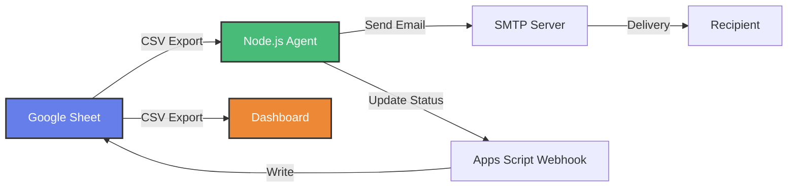

# Email Automation System

A complete email automation system using Google Sheets as the source of truth, a Node.js automation agent, and a real-time dashboard.


## 🌟 Features

- **📊 Google Sheets Integration** - Use a publicly shared Google Sheet as your email database
- **🤖 Automated Email Sending** - Node.js agent automatically processes and sends emails
- **📈 Real-time Dashboard** - Beautiful, modern dashboard showing email statistics
- **✅ Status Tracking** - Track sent, failed, and pending emails
- **🔄 Auto-refresh** - Dashboard updates automatically every 30 seconds
- **⚡ No Google Cloud Required** - Uses public sheet access and Apps Script webhook

## 📁 Project Structure

```
email-automation-system/
├── agent/                      # Node.js automation agent
│   ├── src/
│   │   ├── index.js           # Main agent logic
│   │   ├── sheetReader.js     # Read from public sheet
│   │   ├── emailSender.js     # Send emails via Nodemailer
│   │   └── sheetUpdater.js    # Update sheet via webhook
│   ├── package.json
│   └── .env.example
├── dashboard/                  # Web dashboard
│   ├── index.html
│   ├── styles.css
│   └── app.js
├── google-apps-script/         # Apps Script for webhook
│   └── webhook.gs
└── README.md
```

## 🚀 Quick Start

### 1. Set Up Google Sheet

1. **Create a new Google Sheet** with the following columns (exact names):
   ```
   Email | Subject | Body | Status | Sent At | Error
   ```

2. **Add sample data**:
   | Email | Subject | Body | Status | Sent At | Error |
   |-------|---------|------|--------|---------|-------|
   | test@example.com | Test Email | Hello, this is a test email! | Pending | | |

3. **Make the sheet public**:
   - Click "Share" → "Change to anyone with the link"
   - Set permission to "Viewer"
   - Copy the Sheet ID from the URL: `https://docs.google.com/spreadsheets/d/{SHEET_ID}/edit`

### 2. Deploy Google Apps Script Webhook

1. Open your Google Sheet
2. Go to **Extensions** → **Apps Script**
3. Delete any existing code
4. Copy the contents of `google-apps-script/webhook.gs` and paste it
5. Click **Deploy** → **New deployment**
6. Settings:
   - Type: **Web app**
   - Execute as: **Me**
   - Who has access: **Anyone**
7. Click **Deploy** and copy the **Web app URL**

### 3. Configure the Agent

1. **Navigate to the agent directory**:
   ```bash
   cd agent
   ```

2. **Install dependencies**:
   ```bash
   npm install
   ```

3. **Create `.env` file** (copy from `.env.example`):
   ```bash
   cp .env.example .env
   ```

4. **Edit `.env` file** with your configuration:
   ```env
   # Google Sheet Configuration
   SHEET_ID=your_google_sheet_id_here
   WEBHOOK_URL=your_apps_script_webhook_url_here

   # SMTP Configuration (Gmail example)
   SMTP_HOST=smtp.gmail.com
   SMTP_PORT=587
   SMTP_USER=your_email@gmail.com
   SMTP_PASS=your_app_password_here

   # Agent Configuration
   CHECK_INTERVAL=60000
   FROM_EMAIL=your_email@gmail.com
   FROM_NAME=Email Automation System
   ```

   **For Gmail:**
   - Use an [App Password](https://support.google.com/accounts/answer/185833) instead of your regular password
   - Enable 2-factor authentication first
   - Generate an app password at: https://myaccount.google.com/apppasswords

### 4. Configure the Dashboard

1. **Edit `dashboard/app.js`**:
   ```javascript
   const SHEET_ID = 'your_google_sheet_id_here';
   ```
   Replace with your actual Google Sheet ID.

### 5. Run the System

1. **Start the agent**:
   ```bash
   cd agent
   npm start
   ```

   You should see:
   ```
   ╔════════════════════════════════════════════════════════════╗
   ║        Email Automation Agent - Starting Up               ║
   ╚════════════════════════════════════════════════════════════╝

   ✓ Configuration validated
   ✓ SMTP connection verified

   📧 Agent will check for new emails every 60 seconds
   ```

2. **Open the dashboard**:
   - Open `dashboard/index.html` in your web browser
   - You should see your email statistics and recent emails

## 📊 How It Works



### Workflow

1. **Agent reads** pending emails from Google Sheet (via CSV export URL)
2. **Agent sends** emails using Nodemailer and SMTP
3. **Agent updates** sheet status via Apps Script webhook
4. **Dashboard displays** real-time statistics by reading the sheet
5. **Process repeats** every 60 seconds (configurable)

## 🎨 Dashboard Features

The dashboard provides a beautiful, modern interface with:

- **📊 Statistics Cards**: Total, Sent, Failed, and Pending email counts
- **📋 Email Table**: Recent emails with status badges
- **🔄 Auto-refresh**: Updates every 30 seconds
- **✨ Premium Design**: Glassmorphism, gradients, and smooth animations
- **📱 Responsive**: Works on desktop, tablet, and mobile

## 🔧 Configuration Options

### Agent Configuration (`.env`)

| Variable | Description | Example |
|----------|-------------|---------|
| `SHEET_ID` | Google Sheet ID | `1abc...xyz` |
| `WEBHOOK_URL` | Apps Script webhook URL | `https://script.google.com/...` |
| `SMTP_HOST` | SMTP server hostname | `smtp.gmail.com` |
| `SMTP_PORT` | SMTP server port | `587` (TLS) or `465` (SSL) |
| `SMTP_USER` | SMTP username | `your_email@gmail.com` |
| `SMTP_PASS` | SMTP password | App password for Gmail |
| `CHECK_INTERVAL` | Check interval in ms | `60000` (60 seconds) |
| `FROM_EMAIL` | Sender email address | `your_email@gmail.com` |
| `FROM_NAME` | Sender display name | `Email Automation System` |

### Dashboard Configuration (`app.js`)

```javascript
const SHEET_ID = 'your_google_sheet_id_here';
const REFRESH_INTERVAL = 30000; // 30 seconds
```

## 📝 Google Sheet Structure

Your Google Sheet must have these exact column headers in row 1:

| Column | Description | Example Values |
|--------|-------------|----------------|
| **Email** | Recipient email address | `user@example.com` |
| **Subject** | Email subject line | `Welcome to our service` |
| **Body** | Email body content | `Hello, thank you for signing up!` |
| **Status** | Email status | `Pending`, `Sent`, `Failed` |
| **Sent At** | Timestamp when sent | `2025-11-23T05:30:00.000Z` |
| **Error** | Error message if failed | `Invalid email address` |

**Important**: 
- Set initial status to `Pending` for emails you want to send
- The agent will update `Status`, `Sent At`, and `Error` columns automatically

## 🐛 Troubleshooting

### Agent Issues

**"Failed to connect to SMTP server"**
- Check your SMTP credentials in `.env`
- For Gmail, ensure you're using an App Password, not your regular password
- Verify 2-factor authentication is enabled

**"Failed to fetch sheet"**
- Verify the Sheet ID is correct
- Ensure the sheet is shared publicly (Anyone with the link → Viewer)
- Check the sheet has the correct column headers

**"Failed to update sheet"**
- Verify the webhook URL is correct
- Ensure the Apps Script is deployed as a web app
- Check "Who has access" is set to "Anyone"

### Dashboard Issues

**"No emails found"**
- Update `SHEET_ID` in `dashboard/app.js`
- Ensure the sheet has data rows (not just headers)
- Check browser console for errors (F12)

**"Configuration Required" notice**
- You haven't updated the `SHEET_ID` in `app.js`
- Replace `'your_google_sheet_id_here'` with your actual Sheet ID

## 🔒 Security Considerations

- **SMTP Credentials**: Never commit `.env` file to version control
- **App Passwords**: Use app-specific passwords, not your main account password
- **Public Sheet**: Only share sheets that don't contain sensitive data
- **Webhook**: The webhook URL is public but only accepts POST requests with specific data

## 📈 Scaling & Production Use

For production use, consider:

1. **Rate Limiting**: Add delays between emails to avoid SMTP rate limits
2. **Error Handling**: Implement retry logic for failed sends
3. **Logging**: Add proper logging with timestamps
4. **Monitoring**: Set up alerts for failed emails
5. **Authentication**: Add authentication to the Apps Script webhook
6. **Database**: For large volumes, consider migrating from Google Sheets to a proper database

## 🛠️ Development

### Running in Development Mode

```bash
cd agent
npm run dev  # Uses --watch flag for auto-restart
```

### Testing the Webhook

Use the `testWebhook()` function in Apps Script:
1. Open Apps Script editor
2. Select `testWebhook` from the function dropdown
3. Click Run
4. Check execution log

## 📄 License

MIT License - feel free to use this project for any purpose.

## 🤝 Contributing

Contributions are welcome! Feel free to:
- Report bugs
- Suggest features
- Submit pull requests

## 💡 Tips

- **Start Small**: Test with 1-2 emails first
- **Check Spam**: Sent emails might go to spam initially
- **Monitor Logs**: Watch the agent console for real-time status
- **Use App Passwords**: For Gmail, always use app-specific passwords
- **Keep Sheet Simple**: Don't add extra columns or formatting

## 📞 Support

If you encounter issues:
1. Check the Troubleshooting section
2. Review the agent console logs
3. Verify all configuration steps
4. Check browser console for dashboard errors

---

**Built with ❤️ using Node.js, Google Sheets, and modern web technologies**
